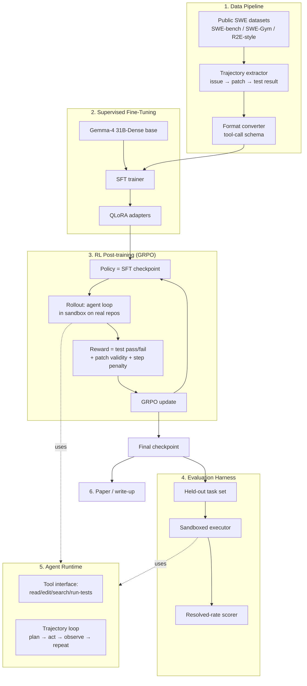
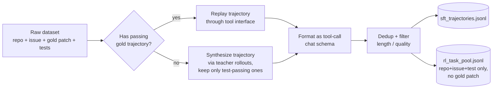
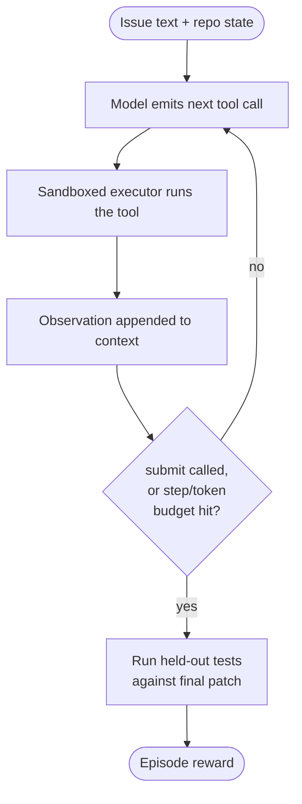
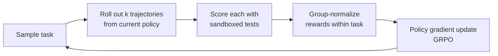
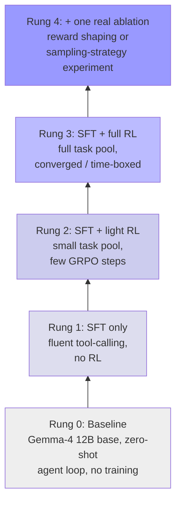

# ARCHITECTURE.md — Gemma-4 Coding Agent (Kaggle Developer Agent Competition)
> Post-train Gemma 4 into an autonomous software-engineering agent that resolves
> real repo issues offline, on consumer hardware. Target: max resolved-rate on
> held-out SWE tasks, within a Kaggle-compute budget, with a documented,
> reproducible method for the Paper Track.

---

## 0. Design principles (read this before writing code)

1. **Verifiable reward or it doesn't count.** Every training signal must reduce
   to "did a real test suite pass." No LLM-judged rewards, no vibes.
2. **SFT teaches the *shape*, RL teaches the *skill*.** SFT gets the model
   fluent in the tool-call format and the edit→test→retry loop. RL is what
   actually improves resolve-rate. Don't over-invest in SFT data volume at the
   expense of RL time.
3. **Right-size the model to the compute you actually have.** Gemma 4 12B is
   the primary target — 4-bit weights are ~6.7GB, which fits a single
   Kaggle free-tier T4/P100 (16GB) with real headroom for gradients and
   activations. E4B (~2.2GB int4) is the fallback if 12B is still tight
   once training overhead is added, and is small enough to run inference
   locally for dev/debug. 31B-Dense (~17.5GB int4) is out of reach on free
   compute and isn't the priority — see §0.6.
4. **Sandbox everything that executes model output.** Model-written code runs
   in a network-isolated, resource-limited sandbox. This is non-negotiable —
   it's also your eval harness, so build it first and test it adversarially
   before anything else depends on it.
5. **Small and finished beats large and half-built.** Scope to what fits in
   the compute/time budget below. A clean SFT+light-RL pipeline with a good
   write-up beats a sprawling unfinished system.
6. **"Runs on consumer hardware" is a feature, not just a constraint.** The
   competition's own framing is agents "equally capable offline, on
   consumer hardware." Targeting Gemma 4 12B/E4B instead of 31B isn't a
   compromise forced by a modest laptop — it's a legitimate angle for the
   write-up: a smaller model that closes most of the gap while actually
   being deployable is a real result, not a consolation prize.

---

## 1. System overview



---

## 2. Component breakdown

### 2.1 Data pipeline (`data/`)

**Goal:** turn public issue-resolution datasets into (prompt, tool-call
trajectory, ground-truth test) triples the SFT trainer and the RL reward
function can both consume.



- **`sft_trajectories.jsonl`** — full trajectories for SFT.
- **`rl_task_pool.jsonl`** — just the task + hidden test; the policy has to
  solve it itself during RL rollouts. Held strictly separate from the SFT
  set to avoid contamination.
- Keep a third, **untouched** held-out split for final evaluation — never
  seen in SFT or RL.

### 2.2 Tool interface / agent runtime (`agent/`)

A minimal, fixed set of tools — this is the "API" the model is trained to
call. Keep it small; every tool you add is another thing the model has to
learn to use correctly.

| Tool | Purpose |
|---|---|
| `read_file(path)` | View file contents |
| `search_repo(query)` | Grep/semantic search across the repo |
| `edit_file(path, diff)` | Apply a patch |
| `run_tests(target)` | Execute the test suite (or a subset), sandboxed |
| `submit(patch)` | End the episode with a final patch |



### 2.3 Sandbox / executor (`sandbox/`)

Build and adversarially test this **before** anything else depends on it —
it is both the RL reward source and the eval harness.

- No shell interpreter — argv is split and exec'd directly; metacharacters are inert.
- Binary allowlist (no `sh`, `curl`, `ssh`, `sudo`, etc.).
- Fresh network namespace per episode — no egress.
- CPU-time / memory / process-count rlimits.
- Working directory resolved and scope-checked (symlink escapes included).
- Every run produces a typed result (`pass`, `fail`, `timeout`, `error`) —
  never a silent empty result.

### 2.4 SFT trainer (`train/sft/`)

- Base: **Gemma-4 12B** (primary target; drop to **E4B** if 12B is still
  tight once gradients/activations/optimizer state are added on top of the
  ~6.7GB int4 weight footprint — see §0.3 and §5).
- Method: QLoRA (4-bit base, LoRA adapters on attention + MLP projections).
- Objective: next-token loss on trajectory completions only (mask the
  prompt/observations, train only on the model's own tool-call + reasoning
  tokens).
- Output: adapter checkpoint used to initialize the RL policy.

### 2.5 RL trainer (`train/rl/`)

- Algorithm: **GRPO** (group-relative policy optimization) — no separate
  value network to train, which matters under a tight compute budget.
- Rollout: sample *k* trajectories per task from `rl_task_pool.jsonl`,
  through the same agent loop/tool interface as eval.
- Reward, composed of:
  1. **Primary (dominant weight):** held-out tests pass/fail on the
     submitted patch.
  2. **Patch validity:** applies cleanly, non-empty, touches the repo (not
     a no-op).
  3. **Small step penalty:** discourages runaway tool-call loops.
- Group-normalize rewards within each task's *k* samples, update policy.



### 2.6 Evaluation harness (`eval/`)

- Runs the frozen held-out split only.
- Reports: resolved-rate (primary metric), average steps-to-submit, patch
  validity rate, and per-repo breakdown.
- Same sandbox as RL — different task set, no gradient updates.

### 2.7 Paper / write-up (`paper/`)

Written incrementally, not at the deadline:
- Method description (SFT data construction, RL reward design, GRPO config).
- Ablations: SFT-only vs. SFT+RL; effect of *k* (rollouts per task); reward
  component ablation.
- Failure-mode analysis: categorize unresolved tasks (wrong file, incomplete
  patch, test-environment issue, step-budget exhaustion).
- Honest scope statement: what was and wasn't attempted, given the compute
  and time budget.

---

## 3. Algorithms (pseudocode)

### 3.1 SFT data construction

```
for each (repo, issue, gold_patch, tests) in raw_dataset:
    if gold_patch passes tests in sandbox:
        trajectory = replay_via_tool_interface(repo, issue, gold_patch)
    else:
        trajectory = None
        for attempt in range(N_TEACHER_ATTEMPTS):
            candidate = teacher_model.rollout(repo, issue)
            if candidate.patch passes tests in sandbox:
                trajectory = candidate
                break
    if trajectory is not None:
        write(trajectory, sft_trajectories.jsonl)
    write((repo, issue, tests), rl_task_pool.jsonl)   # gold patch withheld
```

### 3.2 Agent rollout (shared by RL and eval)

```
function rollout(policy, repo, issue, max_steps):
    context = init_context(repo, issue)
    for step in range(max_steps):
        action = policy.generate_tool_call(context)
        result = sandbox.execute(action)          # typed result, never silent
        context.append(action, result)
        if action.tool == "submit":
            break
    return score(action.patch, tests)              # pass / fail / invalid
```

### 3.3 GRPO update (per task batch)

```
for task in sample_batch(rl_task_pool):
    trajectories = [rollout(policy, task) for _ in range(k)]
    rewards = [reward_fn(t) for t in trajectories]
    normalized = (rewards - mean(rewards)) / (std(rewards) + eps)
    loss = -sum(normalized[i] * logprob(policy, trajectories[i]) for i in range(k))
    policy.step(loss)
```

---

## 4. File structure

```
gemma4-coding-agent/
├── ARCHITECTURE.md                 # this file
├── README.md
├── pyproject.toml
├── configs/
│   ├── sft_config.yaml             # QLoRA hyperparams, base model path
│   ├── rl_config.yaml              # GRPO hyperparams, k, reward weights
│   └── eval_config.yaml            # held-out set path, step budget
│
├── data/
│   ├── raw/                        # untouched downloaded datasets
│   ├── scripts/
│   │   ├── build_sft_trajectories.py
│   │   ├── build_rl_task_pool.py
│   │   └── build_holdout_split.py
│   ├── sft_trajectories.jsonl
│   ├── rl_task_pool.jsonl
│   └── holdout_tasks.jsonl         # never touched by SFT or RL
│
├── sandbox/
│   ├── executor.py                 # exec, no shell interpreter
│   ├── namespace.py                 # network/process isolation
│   ├── limits.py                    # rlimits (cpu/mem/nproc)
│   └── tests/
│       └── test_escape_attempts.py  # adversarial sandbox tests — write FIRST
│
├── agent/
│   ├── tools/
│   │   ├── read_file.py
│   │   ├── search_repo.py
│   │   ├── edit_file.py
│   │   ├── run_tests.py
│   │   └── submit.py
│   ├── loop.py                      # plan → act → observe loop
│   └── context.py                   # trajectory/context management
│
├── train/
│   ├── sft/
│   │   ├── trainer.py
│   │   └── data_collator.py
│   └── rl/
│       ├── grpo.py
│       ├── rollout_worker.py
│       └── reward.py
│
├── eval/
│   ├── run_eval.py
│   └── report.py                    # resolved-rate, breakdown by repo
│
├── checkpoints/
│   ├── sft/
│   └── rl/
│
├── paper/
│   ├── draft.md
│   ├── ablations/
│   └── figures/
│
└── scripts/
    ├── run_sft.sh
    ├── run_rl.sh
    └── run_eval.sh
```

---

## 5. Compute environment

| Where | Used for |
|---|---|
| **Dell Inspiron 14 7400** (16GB RAM, MX350 2GB) | Sandbox development + adversarial testing (§2.3), data pipeline scripts (§2.1), agent loop/tool interface logic (§2.2), CPU inference on **E4B** (~2.2GB int4) for debugging the agent loop end-to-end before touching real training, writing (§2.7) |
| **Kaggle free GPU/TPU quota** | All SFT and RL training runs on **12B** (~6.7GB int4, fits a single T4/P100 with headroom), full-scale eval runs |
| **Paid cloud (RunPod/Lambda/vast.ai) — contingency only** | Crunch-period insurance if Kaggle quota resets don't line up with your schedule near the deadline; not required if quota is managed well |

Checkpoint frequently and design training to be resumable — free-tier
sessions have hard time limits, and losing an unsaved run to a session
timeout is a purely avoidable failure mode.

## 6. Compute & timeline (solo dev, Kaggle quota, deadline Nov 25 2026)

| Phase | Weeks | Deliverable |
|---|---|---|
| 1. Sandbox + tool interface | 1 | Escape-tested executor, 5 tools wired |
| 2. Data pipeline | 1–2 | `sft_trajectories.jsonl`, `rl_task_pool.jsonl`, `holdout_tasks.jsonl` |
| 3. SFT | 1 | QLoRA checkpoint fluent in tool-call format |
| 4. RL (GRPO) | 2–3 | Resolved-rate improving over SFT-only baseline |
| 5. Eval + ablations | 1 | Final numbers, failure-mode breakdown |
| 6. Write-up | ongoing, finalize last week | Paper Track submission |

Build the sandbox first and test it adversarially — every other phase
depends on it working correctly, and bugs found late here are the most
expensive to fix.

---

## 7. What *not* to build

To stay inside scope for a solo, time-boxed entry:
- No multi-agent orchestration (planner + sub-agents) — one policy, one loop.
- No custom UI/dashboard — CLI + eval report is enough.
- No speech/vision/desktop-automation surfaces.
- No 26B MoE or 31B-Dense as the primary target — 12B/E4B only, per §0.3.
  Revisit only if 12B training is comfortably under quota with time to
  spare after Rung 3 (§8.1).
- No synthetic-data-at-scale generation pass unless the public datasets
  prove insufficient after phase 2.

---

## 8. De-risking plan — what's actually in our control

We can't control other teams, judging variance, or held-out-set luck. What
we *can* control: never being caught with nothing to submit, catching
failures early instead of at the deadline, and making every phase produce
something usable even if the next phase runs out of time or doesn't pan out.
That's the actual lever here — not a rigid critical path, a **ladder** where
every rung is a valid stopping point.

### 8.1 The fallback ladder

Each rung below is a **complete, submittable entry** on its own. You always
move up the ladder — you never depend on reaching the top rung to have
something to hand in.



- **Rung 0 exists on day 1.** Wire the agent loop + sandbox to the *base*
  model with no training at all, run it on the held-out set, get a number.
  This is your safety net — it proves the harness works end-to-end before
  a single GPU-hour is spent training, and it's a real baseline number for
  the write-up either way.
- **Every rung after that is additive, not a rewrite.** SFT doesn't replace
  the eval harness; RL doesn't replace the SFT checkpoint's ability to run.
  If RL destabilizes late, you fall back to the SFT checkpoint and still
  submit Rung 1 — not nothing.
- **Freeze a checkpoint at the end of every rung**, before starting the
  next. This is the actual "bulletproofing": no phase is allowed to leave
  you without a working, scoreable artifact from the previous one.

### 8.2 Pre-committed decision gates

Decide these thresholds *now*, in writing, so a bad week doesn't turn into
a bad month of chasing something that isn't working:

| Gate | Check | If it fails |
|---|---|---|
| End of Week 1 | Sandbox passes adversarial tests + Rung 0 produces a real (nonzero) resolved-rate | Fix the harness before touching training — nothing downstream is trustworthy until this is true |
| End of Week 2–3 | `sft_trajectories.jsonl` has enough clean, test-verified examples (target: define a minimum, e.g. 500–1000) | Fall back to a smaller public dataset subset or lower the bar on trajectory length; do not stall data collection past this gate |
| End of SFT | SFT checkpoint's tool-call format is >90% syntactically valid on a sample rollout | If not, more SFT epochs / data cleanup before RL — a policy that can't call tools cleanly will not learn anything useful from RL reward |
| Mid-RL checkpoint | Resolved-rate on a dev slice (not the frozen holdout) is trending above the SFT-only baseline | If flat/negative after a defined compute budget, stop RL, ship Rung 1/2, spend remaining time on the ablation instead |
| 1 week before deadline | Final checkpoint frozen, eval run on holdout, numbers locked | No more training after this — remaining time is write-up and packaging only |

### 8.3 Risk register

| Risk | Likelihood | Mitigation |
|---|---|---|
| Sandbox has an escape or silently mis-scores | High impact if missed | Adversarial test suite written *before* trusting any reward/eval number (§2.3) |
| Public datasets insufficient in volume/quality | Medium | Gate at §7.2 Week 2–3; fallback = smaller curated subset + teacher-rollout synthesis (already in §3.1), not from-scratch generation |
| GPU/TPU quota runs out mid-RL | Medium-high on free tiers | Checkpoint every N GRPO steps; design RL to be resumable; know your quota reset schedule in advance and plan around it |
| RL destabilizes (reward hacking, collapse) | Medium | Small step penalty + patch-validity check already in reward (§2.5); keep frozen SFT checkpoint as fallback; short eval-on-dev-slice checks catch this before it wastes the full budget |
| Time runs out before RL converges | High for a solo entry | This is *why* the ladder exists — Rung 2 (light RL) is a legitimate submission, not a failure state |
| Model too large for available memory | Low | Already mitigated by §0.3's model choice — 12B int4 (~6.7GB) fits a single free-tier T4/P100; E4B (~2.2GB) is the drop-in fallback if 12B training overhead is still tight |
| Held-out contamination (task leaks into SFT/RL data) | High impact, easy to miss | `holdout_tasks.jsonl` built once, never touched by any script after §4 `data/scripts/build_holdout_split.py` runs — treat it as read-only from that point on |

### 8.4 What's in your control vs. not

| In your control | Not in your control |
|---|---|
| Sandbox correctness | Other teams' compute budget or experience |
| Data quality/verification | Judging variance on the held-out set |
| Always having a submittable checkpoint | Whether your one real ablation happens to be the insight that mattered |
| Catching instability early via gates | Kaggle infra hiccups |
| Write-up honesty and clarity | Leaderboard placement of others |

The plan is only "bulletproof" in the sense that it removes the failure
modes that are yours to remove — an empty submission, an untested reward
signal, a broken harness discovered on the last day. It can't remove the
parts that were never within either of our control to begin with.

---

## 9. Where to use LLM assistance, and where not to

The honest split isn't "use it everywhere" or "avoid it entirely" — it's
which parts of this project are *implementation* (a known pattern you're
assembling) versus *judgment* (a choice that determines whether the whole
thing actually works, where you need to understand *why*, not just *that*
it runs).

### 9.1 Good candidates for LLM-assisted / LLM-written code

Fast, low-risk, well-trodden — verify it runs and passes tests, move on:

- **Boilerplate & plumbing**: dataset loading/parsing scripts, JSONL
  read/write, config parsing (`configs/*.yaml` loaders), CLI argument
  handling, logging setup.
- **The individual tool implementations** in `agent/tools/` (`read_file`,
  `search_repo`, `edit_file`) — these are well-defined I/O operations with an
  obvious correct behavior.
- **Test scaffolding** — writing the *shape* of `sandbox/tests/`, then you
  fill in the adversarial cases that matter (see §9.2).
- **Data pipeline glue**: `data/scripts/build_sft_trajectories.py`'s
  file-format conversion and dedup logic.
- **Eval reporting** (`eval/report.py`): formatting resolved-rate tables,
  per-repo breakdowns, plots for the paper.
- **Debugging error messages, stack traces, dependency/environment issues**
  — classic fast-turnaround LLM use.

### 9.2 Use LLM help to draft, but you must own the reasoning

You can ask for a first pass, but you need to actually understand and be
able to defend every line here — this is where "it ran without errors"
and "it's correct" are not the same thing:

- **The sandbox's security logic** (`sandbox/namespace.py`,
  `sandbox/limits.py`, the escape-attempt tests) — an LLM can draft the
  isolation code, but *you* need to reason through what an adversarial
  model-generated command could try, because a subtly wrong sandbox
  silently invalidates every reward signal downstream.
- **The reward function** (`train/rl/reward.py`) — the exact weighting
  between test-pass, patch-validity, and step-penalty is a judgment call
  that shapes what the policy learns to optimize for. Get a draft fast,
  then reason through it yourself: what would the model do to game *this
  exact* reward as written?
- **The GRPO training loop** (`train/rl/grpo.py`) — the algorithm is
  standard, but the specific hyperparameters (group size *k*, learning
  rate, KL/entropy regularization if you add it) interact with your
  compute budget in ways only you can tune by watching real runs.

### 9.3 Don't outsource — this has to be yours

Not because an LLM can't produce something that runs, but because these
are exactly the decisions the paper track and your own understanding
depend on:

- **The decision gates and their thresholds** (§8.2) — these encode your
  actual judgment about when something isn't working. Copying generic
  numbers defeats the purpose.
- **Reading and interpreting your own eval/ablation results** — this is
  the actual research contribution. An LLM can help you *compute* a
  number; it can't tell you what the number *means* about your method.
- **The write-up's methodology and honest-scope sections** (§2.7) —
  judges can tell the difference between a result you understand and one
  you're describing secondhand.

### 9.4 One standing rule

For anything in §9.2 or §9.3: if you can't explain *why* a design choice
is correct without looking at the generated code, you don't own it yet —
that's the signal to slow down on that specific piece, not the whole
project. Speed on §9.1 is exactly what buys you the time to go slow where
it counts.
